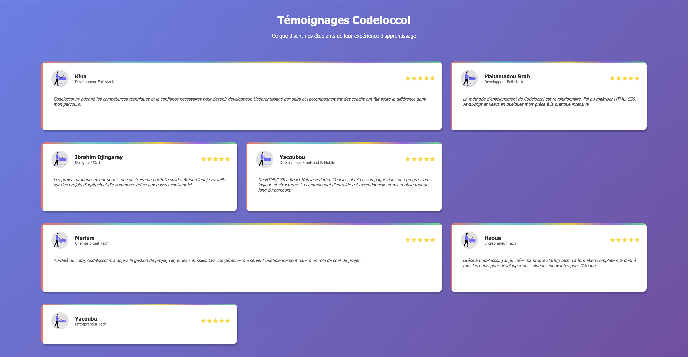
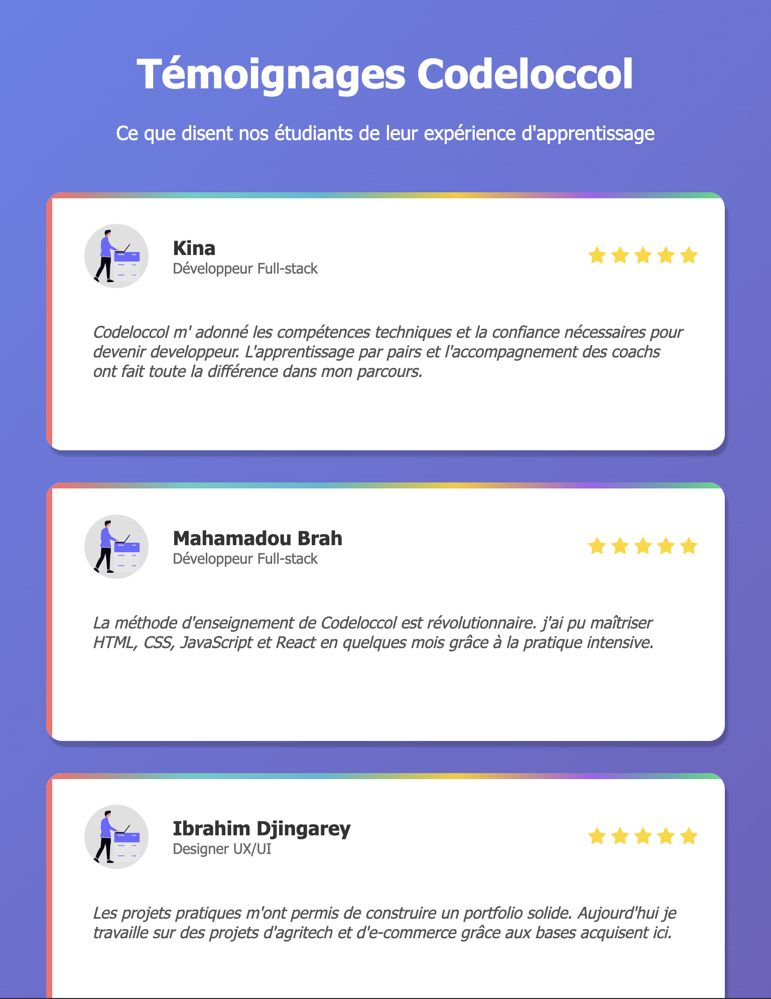
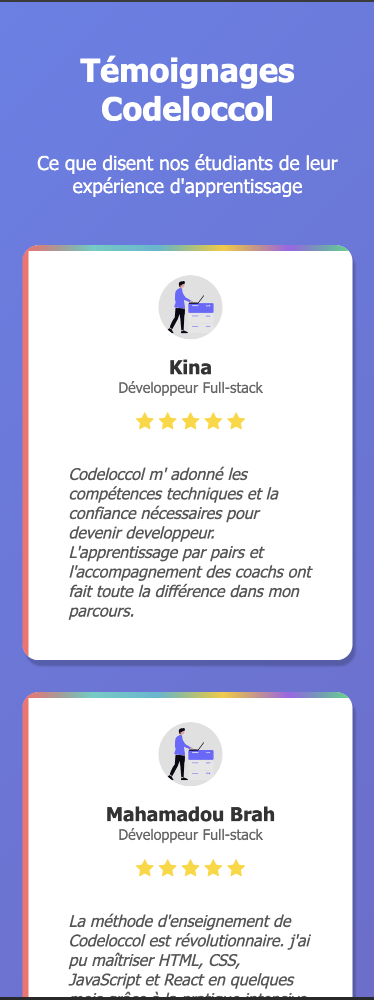

# Projet Testimonials Grid

## Spécifications
Ce projet consiste à réaliser une page web présentant une grille de témoignages d’étudiants de Codeloccol. L’objectif est de mettre en pratique les compétences en HTML et CSS pour structurer, styliser et rendre responsive une interface utilisateur moderne.

* Structurer le contenu avec des balises sémantiques.
* Styliser la page pour un rendu professionnel et attractif.
* Adapter la grille pour une lecture optimale sur tous les écrans.
* Valoriser les retours d’expérience des apprenants.

Ce projet permet de renforcer la maîtrise des bases du développement web tout en travaillant sur un cas concret et motivant.

## Procédure suivie:

### Structure HTML:
A ce niveau, la page fut divisée en deux partie, le header et  le main
* A l'intérieur du header se trouve le titre et un paragraphe.
* le main, qui correspond au corps de la page, il fut divisé en sections contenant chacune un format similaire de texte.

### Strucuture Css
A ce niveau, j'ai utilisé des grilles comme le demande l'exercice. j'ai d'abord divisé le body en 6 colones égales, que j'ai répartie au header et au main. Ensuite le main en 6 colones égales et 4 lignes dont la dernière est plus petite pour les écrans supérieurs à 1440px, une colone et  7 lignes dont la dernière est plus petite pour les mobiles et les petits écrans d'ordinateurs.

## Rendu

### Desktop

### Mobile and small Desktop
 

## Liens
### liens vers repo github:
[Github Repositorry](https://github.com/abbas001900/testimonials_grid.git)
### liens vers la github page:
[Github Page](https://abbas001900.github.io/testimonials_grid/)